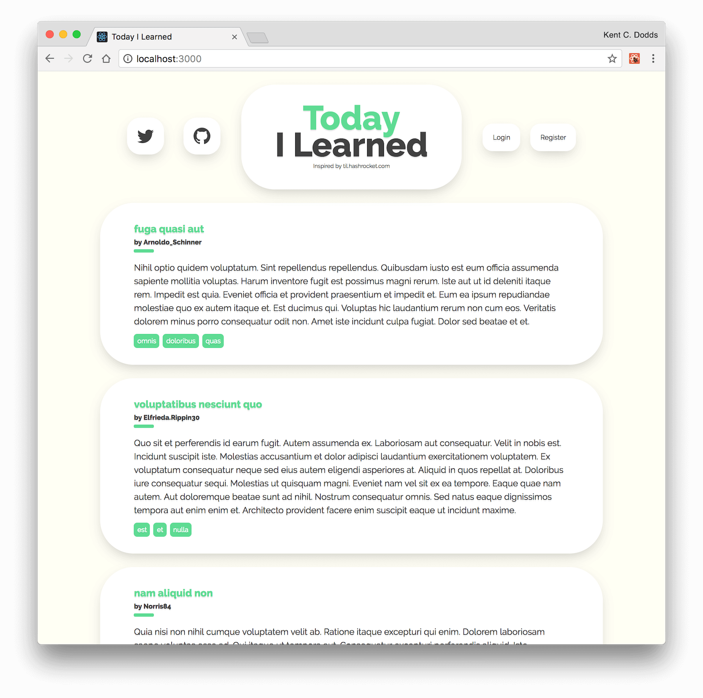

# Testing Workshop

👋 hi there! My name is [Kent C. Dodds](https://kentcdodds.com)! This is a
workshop repo to teach you about testing JavaScript applications.

> **NOTICE**: If you're coming here from
> [my Frontend Masters 2017 workshop](https://frontendmasters.com/courses/testing-javascript/),
> I recommend you watch [the updated 2018 workshop instead](https://frontendmasters.com/courses/testing-react/).
> If you'd rather follow the 2017 workshop, then please
> [go to the `fem` branch](https://github.com/kentcdodds/testing-workshop/tree/fem)
> to make sure you're looking at the accurate information for your workshop.

[![chat-badge][chat-badge]][chat]
[![Build Status][build-badge]][build]
[![AppVeyor Build Status][win-build-badge]][win-build]
[![Code Coverage][coverage-badge]][coverage]
[![License][license-badge]](#license)
[](#contributors)

[![PRs Welcome][prs-badge]][prs]
[![Code of Conduct][coc-badge]][coc]
[![Watch on GitHub][github-watch-badge]][github-watch]
[![Star on GitHub][github-star-badge]][github-star]
[![Tweet][twitter-badge]][twitter]

## Table of Contents

<!-- START doctoc generated TOC please keep comment here to allow auto update -->
<!-- DON'T EDIT THIS SECTION, INSTEAD RE-RUN doctoc TO UPDATE -->
<!-- DON'T EDIT THIS SECTION, INSTEAD RE-RUN doctoc TO UPDATE -->

- [Topics covered](#topics-covered)
- [Branches](#branches)
- [System Requirements](#system-requirements)
- [Setup](#setup)
- [Running the app](#running-the-app)
- [About the app](#about-the-app)
  - [Continuous Integration](#continuous-integration)
  - [Hosting](#hosting)
  - [Register and Login](#register-and-login)
- [Troubleshooting](#troubleshooting)
- [Structure](#structure)
- [Contributors](#contributors)
- [LICENSE](#license)

<!-- END doctoc generated TOC please keep comment here to allow auto update -->

## Topics covered

1.  Unit Testing with [Jest](http://facebook.github.io/jest)
2.  Integration Testing with [Jest](http://facebook.github.io/jest)
3.  End to End (E2E) Testing with [Cypress](https://www.cypress.io/)

We'll mention other forms of testing, but these are the types we'll focus on and
learn in this workshop. Learn more about the course goals and specific topics
covered in the [`INSTRUCTIONS.md`](./INSTRUCTIONS.md) file.

**NOTE: This repository is meant for instructional purposes. While you'll
probably learn a great deal looking through this project, remember that it's
not necessarily a recommendation to test your apps this way. Some code is
"over covered" by unit, integration, and end-to-end tests simply to demonstrate
the differences. In a real application it would be unnecessary to be this
extensive in coverage.**

## Branches

This project has been used to teach about testing in various settings. You may
want to switch to the appropriate branch for this workshop. Otherwise the code
you're looking at may not be exactly the same as the code used in the setting
you're working with.

- Frontend Masters 2017 [`fem`](https://github.com/kentcdodds/testing-workshop/tree/fem)

## System Requirements

- [git][git] v2.14.1 or greater
- [NodeJS][node] v8.9.4 or greater
- [npm][npm] v5.6.0 or greater

All of these must be available in your `PATH`. To verify things are set up
properly, you can run this:

```
git --version
node --version
npm --version
```

If you have trouble with any of these, learn more about the PATH environment
variable and how to fix it here for [windows][win-path] or
[mac/linux][mac-path].

## Setup

After you've made sure to have the correct things (and versions) installed, you
should be able to just run a few commands to get set up:

```
git clone https://github.com/kentcdodds/testing-workshop.git
cd testing-workshop
npm run setup --silent
```

This may take a few minutes. **It will ask you for your email.** This is
optional and just automatically adds your email to the links in the project to
make filling out some forms easier If you get any errors, please read through
them and see if you can find out what the problem is. You may also want to look
at [Troubleshooting](#troubleshooting). If you can't work it out on your own
then please [file an issue][issue] and provide _all_ the output from the
commands you ran (even if it's a lot).

## Running the app

To get the app up and running (and really see if it worked), run:

```shell
npm run dev
```

This will start the api server, and the client server in development mode at
the same time. Your browser should open up automatically to
`http://localhost:3000` (if it doesn't, just open that yourself) and you should
be able to start messing around with the app.

Here's what you should be looking at:



If this fails at any point for you, please take a minute to read through any
error messages you see and [try to troubleshoot the issue](#troubleshooting).
If you can't work it out, feel free to [open an issue][issue].

## About the app

This app is based on the [Hashrocket](https://hashrocket.com/) project called
[Today I Learned](https://til.hashrocket.com/). It's a real working application
but has been simplified to help us focus on learning testing rather than
worrying about distracting ourselves with setting up the project. For example
the database is actually just a simple JavaScript file. Every time you start
the app, all the data is reset (and in development mode, data is randomly
generated).

### Continuous Integration

We're using two CI services:

- [Travis][build] (Linux): find config in `.travis.yml`
- [AppVeyor][win-build] (Windows): find config in `appveyor.yml`

### Hosting

The backend code is deployed to [now.sh](https://now.sh):
[til.now.sh](https://til.now.sh). Try hitting one of the unauthenticated
endpoints like [`/api/posts`](https://til.now.sh/api/posts) (note: it's using
the open source free tier, so it may take a while to respond as it warms up).
The Travis build is responsible for deploying the backend to `now.sh`.

The frontend code is deployed using [netlify](https://netlify.com):
[til.netlify.com](https://til.netlify.com). We could host the frontend code
on `now` as well, except Netlify has some pretty awesome features with GitHub
integration, and I want to show those off (and benefit from them as well).
The frontend code is deployed to netlify using Netlify's integration with
GitHub.

### Register and Login

If you want to login, go ahead and register a new account and login with that
one.

**To stop all the servers**, hit <kbd>Ctrl</kbd> + <kbd>C</kbd>.

## Troubleshooting

<details>

<summary>"npm run setup" command not working</summary>

Here's what the setup script does. If it fails, try doing each of these things
individually yourself:

```
# verify your environment will work with the project
node ./scripts/verify

# install dependencies in the root of the repo
npm install

# install dependencies in the shared directory
npm install --prefix shared

# install dependencies in the server directory
npm install --prefix server

# install dependencies in the client directory
npm install --prefix client

# verify the project is ready to run
npm run lint
npm run test:coverage
npm run test:e2e:run
```

If any of those scripts fail, please try to work out what went wrong by the
error message you get. If you still can't work it out, feel free to
[open an issue][issue] with _all_ the output from that script. I will try to
help if I can.

</details>

<details>

<summary>"npm run dev" command not working</summary>

If it doesn't work for you, you can start each of these individually yourself
(in separate terminals):

```
cd server
npm run dev
```

```
cd client
npm run dev
```

If any of those scripts fail, please try to work out what went wrong by the
error message you get. If you still can't work it out, feel free to
[open an issue][issue] with _all_ the output from that script. I will try to
help if I can.

</details>

<details>

<summary>"npm test" command not working; "./jest" command not working</summary>

When attempting to run Jest in watch mode, you may encounter an error that says
something like:

```
`fsevents` unavailable (this watcher can only be used on Darwin)'
```

Jest watch mode has a dependency on a tool called `watchman`, which needs to be
installed globally on your machine.

To fix this error, please make sure you have [watchman][watchman] installed for
your preferred operating system.

NOTE: installing `watchman` via `npm` installs an outdated version of the package.
To get the latest version of `watchman`, it is preferred that you install through
your operating system's package manager instead.

</details>

## Structure

This project has a bit of a unique setup. Normally you'll have just a single
`package.json` at the root of your repository, but to simplify setup I've
included both the `server` and `client` projects in a single repository. The
root of the project has a `package.json` as does `server`, and `client`. While
you'll be working in the source code and tests in these folders, you should be
able to leave you command line in the root directory for the whole workshop.

## Contributors

Thanks goes to these wonderful people ([emoji key](https://github.com/kentcdodds/all-contributors#emoji-key)):

<!-- ALL-CONTRIBUTORS-LIST:START - Do not remove or modify this section -->
<!-- prettier-ignore -->
| [<br /><sub><b>Kent C. Dodds</b></sub>](https://kentcdodds.com)<br />[💻](https://github.com/kentcdodds/testing-workshop/commits?author=kentcdodds "Code") [📖](https://github.com/kentcdodds/testing-workshop/commits?author=kentcdodds "Documentation") [🚇](#infra-kentcdodds "Infrastructure (Hosting, Build-Tools, etc)") [⚠️](https://github.com/kentcdodds/testing-workshop/commits?author=kentcdodds "Tests") | [<br /><sub><b>Osama Jandali</b></sub>](https://github.com/osamajandali)<br />[💻](https://github.com/kentcdodds/testing-workshop/commits?author=osamajandali "Code") [🎨](#design-osamajandali "Design") | [<br /><sub><b>Stefan Ivic</b></sub>](http://stefanivic.me/)<br />[🐛](https://github.com/kentcdodds/testing-workshop/issues?q=author%3Astefanivic "Bug reports") | [<br /><sub><b>Nick Klepinger</b></sub>](https://github.com/bodiddlie)<br />[🐛](https://github.com/kentcdodds/testing-workshop/issues?q=author%3Abodiddlie "Bug reports") | [<br /><sub><b>Abinav Seelan</b></sub>](http://abinavseelan.com)<br />[🐛](https://github.com/kentcdodds/testing-workshop/issues?q=author%3Aabinavseelan "Bug reports") | [<br /><sub><b>Philip Sotirov</b></sub>](http://philipsotirov.com)<br />[🐛](https://github.com/kentcdodds/testing-workshop/issues?q=author%3Afipo "Bug reports") | [<br /><sub><b>Austin Wood</b></sub>](https://github.com/indiesquidge)<br />[📖](https://github.com/kentcdodds/testing-workshop/commits?author=indiesquidge "Documentation") |
| :---: | :---: | :---: | :---: | :---: | :---: | :---: |
| [<br /><sub><b>WK</b></sub>](https://github.com/wk32)<br />[🐛](https://github.com/kentcdodds/testing-workshop/issues?q=author%3Awk32 "Bug reports") |

<!-- ALL-CONTRIBUTORS-LIST:END -->

This project follows the [all-contributors](https://github.com/kentcdodds/all-contributors) specification. Contributions of any kind welcome!

## LICENSE

This material is available for private, non-commercial use under the
[GPL version 3](http://www.gnu.org/licenses/gpl-3.0-standalone.html). If you
would like to use this material to conduct your own workshop, please contact me
at kent@doddsfamily.us

[npm]: https://www.npmjs.com/
[node]: https://nodejs.org
[git]: https://git-scm.com/
[chat]: https://gitter.im/kentcdodds/testing-workshop
[chat-badge]: https://img.shields.io/gitter/room/kentcdodds/testing-workshop.js.svg?style=flat-square&logo=gitter-white
[build-badge]: https://img.shields.io/travis/kentcdodds/testing-workshop.svg?style=flat-square&logo=travis
[build]: https://travis-ci.org/kentcdodds/testing-workshop
[license-badge]: https://img.shields.io/badge/license-GPL%203.0%20License-blue.svg?style=flat-square
[prs-badge]: https://img.shields.io/badge/PRs-welcome-brightgreen.svg?style=flat-square
[prs]: http://makeapullrequest.com
[donate-badge]: https://img.shields.io/badge/$-support-green.svg?style=flat-square
[donate]: http://kcd.im/donate
[coc-badge]: https://img.shields.io/badge/code%20of-conduct-ff69b4.svg?style=flat-square
[coc]: https://github.com/kentcdodds/testing-workshop/blob/master/other/CODE_OF_CONDUCT.md
[github-watch-badge]: https://img.shields.io/github/watchers/kentcdodds/testing-workshop.svg?style=social
[github-watch]: https://github.com/kentcdodds/testing-workshop/watchers
[github-star-badge]: https://img.shields.io/github/stars/kentcdodds/testing-workshop.svg?style=social
[github-star]: https://github.com/kentcdodds/testing-workshop/stargazers
[twitter]: https://twitter.com/intent/tweet?text=Check%20out%20testing-workshop%20by%20@kentcdodds%20https://github.com/kentcdodds/testing-workshop%20%F0%9F%91%8D
[twitter-badge]: https://img.shields.io/twitter/url/https/github.com/kentcdodds/testing-workshop.svg?style=social
[emojis]: https://github.com/kentcdodds/all-contributors#emoji-key
[all-contributors]: https://github.com/kentcdodds/all-contributors
[win-path]: https://www.howtogeek.com/118594/how-to-edit-your-system-path-for-easy-command-line-access/
[mac-path]: http://stackoverflow.com/a/24322978/971592
[issue]: https://github.com/kentcdodds/testing-workshop/issues/new
[win-build-badge]: https://img.shields.io/appveyor/ci/kentcdodds/testing-workshop.svg?style=flat-square&logo=appveyor
[win-build]: https://ci.appveyor.com/project/kentcdodds/testing-workshop
[coverage-badge]: https://img.shields.io/codecov/c/github/kentcdodds/testing-workshop.svg?style=flat-square
[coverage]: https://codecov.io/github/kentcdodds/testing-workshop
[watchman]: https://facebook.github.io/watchman/docs/install.html
