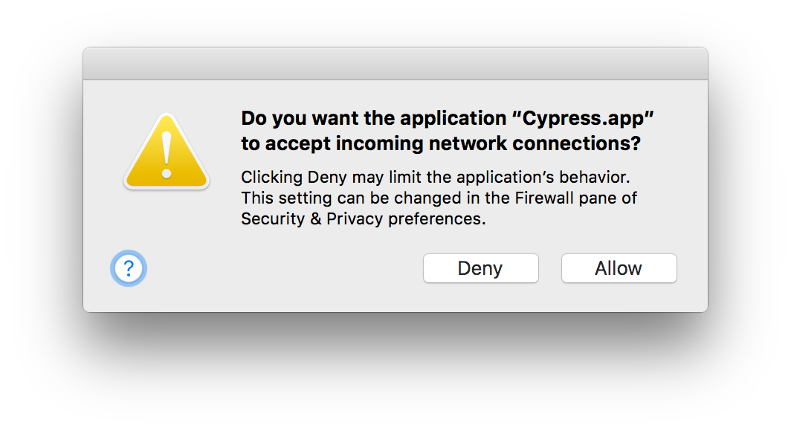
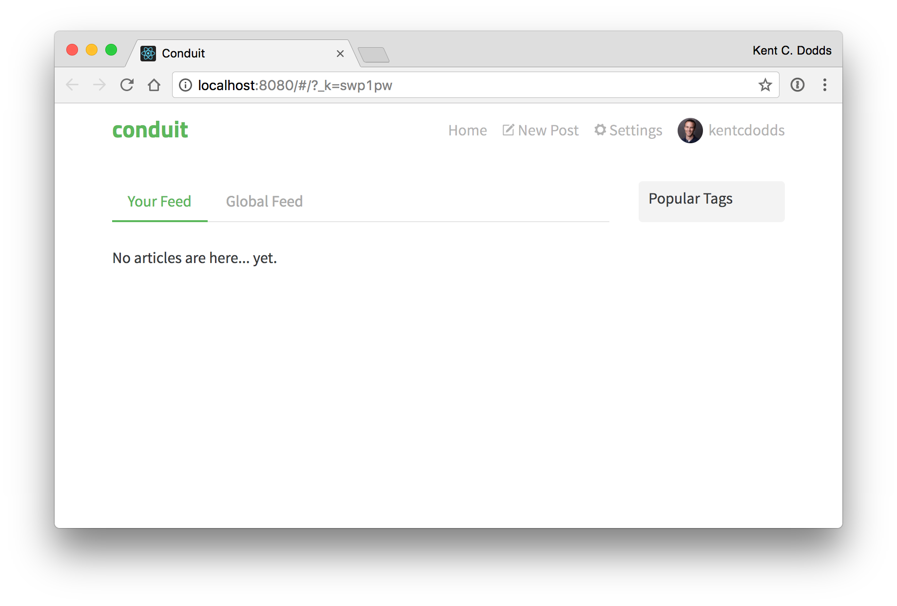

# Testing Workshop

👋 hi there! My name is [Kent C. Dodds](https://kentcdodds.com)! This is a workshop repo to teach you about testing
JavaScript applications.

[![slides-badge][slides-badge]][slides]
[![chat-badge][chat-badge]][chat]
[![Build Status][build-badge]][build]
[![Dependencies][dependencyci-badge]][dependencyci]
[![MIT License][license-badge]][LICENSE]
[](#contributors)

[![PRs Welcome][prs-badge]][prs]
[![Donate][donate-badge]][donate]
[![Code of Conduct][coc-badge]][coc]
[![Watch on GitHub][github-watch-badge]][github-watch]
[![Star on GitHub][github-star-badge]][github-star]
[![Tweet][twitter-badge]][twitter]

## Thank You

Big thanks to the [RealWorld](https://github.com/gothinkster/realworld) project from
[GoThinkster](https://github.com/gothinkster). This project is a copy of
[the Node implementation](https://github.com/gothinkster/node-express-realworld-example-app) and
[the React implementation](https://github.com/GoThinkster/react-redux-realworld-example-app) of the RealWorld project.

Also thank you to all the [contributors](#contributors)

## Topics covered

1. Unit Testing with [Jest](http://facebook.github.io/jest)
2. Integration Testing with [Jest](http://facebook.github.io/jest)
3. End to End (E2E) Testing with [Cypress](https://www.cypress.io/)

We'll mention other forms of testing, but these are the types we'll focus on and learn in this workshop. We'll learn
about the benefits (and tradeoffs) of [TDD](https://en.wikipedia.org/wiki/Test-driven_development). We'll learn how to
configure the tools and why, when, where, and what to test.

## Project

## Branches

This project has been used to teach about testing in various settings. You may want to
switch to the appropriate branch for this workshop. Otherwise the code you're looking
at may not be exactly the same as the code used in the setting you're working with.

- Frontend Masters [`fem`](https://github.com/kentcdodds/testing-workshop/tree/fem)

### System Requirements

- [git][git] v2.10.2 or greater
- [NodeJS][node] v6.9.5 or greater
- [yarn][yarn] v0.20.3 or greater (or [npm][npm] v4.2.0 or greater)
- [MongoDB][mongo] v3.4.2 or greater

All of these must be available in your `PATH`. To verify things are set up properly, you can run this:

```
git --version
node --version
yarn --version
mongod --version
```

If you have trouble with any of these, learn more about the PATH environment variable and how to fix it here for
[windows][win-path] or [mac/linux][mac-path].

### Setup

After you've made sure to have the correct things (and versions) installed, you should be able to just run a few
commands to get set up:

```
git clone https://github.com/kentcdodds/testing-workshop.git
cd testing-workshop
npm run setup --silent
node ./scripts/autofill-feedback-email.js YOUR@EMAIL.com
git commit -am "ready to go"
```

> Change `YOUR@EMAIL.com` to your actual email address

This may take a few minutes. If you get any errors, run `git reset origin/master --hard` to make sure
you have a clean project again,
then please read the error output and see whether there's any
instructions to fix things and try again. If you're still getting errors or need any help at all, then please
[file an issue][issue].

**Note:** You might see this:



I'm not sure how to prevent this from happening (suggestions appreciated!) but it happens every time you run the `e2e`
tests. Just do nothing or hit `Allow` to make it go away (super annoying). Sorry about that 😞

#### Cypress

> If you're a windows user, please see the next section...

For everyone else, you'll want to come with Cypress.io downloaded, installed and have an account ready to go.
Please follow [these instructions](https://docs.cypress.io/docs/installing-and-running) to do this!

##### Windows users!!

Unfortunately, the [cypress](https://www.cypress.io/) application does not yet support the Windows platform.
(Bug them about it [here](https://github.com/cypress-io/cypress/issues/74)).
You should still be able to run cypress in "headless" mode, but you will be unable to open the application
for development.

To get around this issue, you'll have to run the E2E portion of the workshop on Linux or Mac. I recommend either
installing and booting your machine in Linux, or running a Linux Virtual Machine on your Windows computer.

Alternatively, you could just forego the application bit and mostly observe that portion of the workshop. If you're
doing this with a group, perhaps you could pair with someone who has a Mac or Linux machine.

### Running the app

To get the app up and running (and really see if it worked), run:

```shell
npm start dev

# if using yarn
yarn start dev
```


This _should_ start `mongod`, the `api` server, and the `client` server all at
the same time. Your browser should open up automatically to
`http://localhost:8080` (if it doesn't, just open that yourself) and you should
be able to start messing around with the app.

Here's what you should be looking at:



If this fails at any point for you, please first see
[Troubleshooting](#troubleshooting) and if you still can't get it working,
[make an issue][issue].

#### Login

If you want to login, there's a user you can use:

- **Email**: `joe@example.com`
- **Password**: `joe`

**To stop all the servers**, hit <kbd>Ctrl</kbd> + <kbd>C</kbd>.

> Protip: we're using [`nps`](https://github.com/kentcdodds/nps) in this
> project. If you want to type less, then you can install `nps` globally:
> `yarn global add nps` (or `npm i -g nps`) and then you can run `nps`
> instead of `npm start`

### Troubleshooting

<details>

<summary>"npm run setup" command not working</summary>

Here's what the setup script does. If it fails, try doing each of these things individually yourself:

```
# verify your environment will work with the project
node ./scripts/verify

# install dependencies in the root of the repo
yarn

# install dependencies in the api directory
cd api
yarn

# install dependencies in the client directory
cd ../client
yarn

# get back to the root of the repo
cd ..

# load the database with fake data
node ./scripts/load-database

# verify the project is ready to run
npm start lint
npm start split.api.verify
npm start split.client.verify
npm start split.e2e.verify
```

If any of those scripts fail, feel free to file an issue with the output from that script.
I will try to help if I can.

In addition, during some of these steps, some files get temporarily changed and if they fail,
then you may have changed but not cleaned up. So when everything's finished. Run:

```
git reset --hard HEAD
```

Just to make sure nothing's left over.

</details>

<details>

<summary>"npm start dev" command not working</summary>

If it doesn't work for you, you can start each of these individually yourself:

```
npm start dev.mongo
```

```
npm start dev.api
```

```
npm start dev.client
```

</details>

<details>

<summary>"verify.js" is saying something's wrong with mongo</summary>

The `mongod` binary needs to be available in your path for you to run `mongod` from the command line (which is what this
project's scripts does for you). Learn how to do this [on windows][win-path] or [on mac][mac-path].

> Note: you'll need to open a new terminal/command prompt window after you've done this.

</details>

### Structure

This project has a bit of a unique setup. Normally you'll have just a single `package.json` at the root of your
repository, but to simplify setup I've included both the `api` and `client` projects in a single repository. The root
of the project has a `package.json` as does `api`, and `client`. Most of our time working on tooling and running tests
will be in one of these sub-directories (with the exception of the E2E tests).

[issue]: https://github.com/kentcdodds/testing-workshop/issues/new

# LICENSE

The original projects are licensed as noted in their respective `package.json` files. The rest of this project is MIT
licensed.

## Contributors

Thanks goes to these wonderful people ([emoji key](https://github.com/kentcdodds/all-contributors#emoji-key)):

<!-- ALL-CONTRIBUTORS-LIST:START - Do not remove or modify this section -->
| [<br /><sub>Thinkster</sub>](https://thinkster.io)<br />[💻](https://github.com/kentcdodds/testing-workshop/commits?author=gothinkster) | [<br /><sub>Kent C. Dodds</sub>](https://kentcdodds.com)<br />[💻](https://github.com/kentcdodds/testing-workshop/commits?author=kentcdodds) [📖](https://github.com/kentcdodds/testing-workshop/commits?author=kentcdodds) 🚇 [⚠️](https://github.com/kentcdodds/testing-workshop/commits?author=kentcdodds) | [<br /><sub>Callum Mellor-Reed</sub>](http://callummr.com)<br />[🐛](https://github.com/kentcdodds/testing-workshop/issues?q=author%3Acallummr) [💻](https://github.com/kentcdodds/testing-workshop/commits?author=callummr) | [<br /><sub>Eric McCormick</sub>](https://ericmccormick.io)<br />[🐛](https://github.com/kentcdodds/testing-workshop/issues?q=author%3Aedm00se) [💻](https://github.com/kentcdodds/testing-workshop/commits?author=edm00se) | [<br /><sub>Paul Falgout</sub>](http://otterball.com)<br />[💻](https://github.com/kentcdodds/testing-workshop/commits?author=paulfalgout) [📖](https://github.com/kentcdodds/testing-workshop/commits?author=paulfalgout) | [<br /><sub>Brett Caudill</sub>](https://github.com/asBrettisay)<br />[💻](https://github.com/kentcdodds/testing-workshop/commits?author=asBrettisay) [📖](https://github.com/kentcdodds/testing-workshop/commits?author=asBrettisay) | [<br /><sub>Jennifer Mann</sub>](http://jennifermann.ghost.io)<br />[🐛](https://github.com/kentcdodds/testing-workshop/issues?q=author%3Ajennifer-mann) |
| :---: | :---: | :---: | :---: | :---: | :---: | :---: |
| [<br /><sub>Brian Mann</sub>](https://cypress.io)<br />[🐛](https://github.com/kentcdodds/testing-workshop/issues?q=author%3Abrian-mann) | [<br /><sub>Francisco Ramini</sub>](https://github.com/framini)<br />[📖](https://github.com/kentcdodds/testing-workshop/commits?author=framini) |
<!-- ALL-CONTRIBUTORS-LIST:END -->

This project follows the [all-contributors](https://github.com/kentcdodds/all-contributors) specification. Contributions of any kind welcome!

[npm]: https://www.npmjs.com/
[yarn]: https://yarnpkg.com/
[node]: https://nodejs.org
[git]: https://git-scm.com/
[mongo]: https://www.mongodb.com/
[slides]: http://kcd.im/testing-workshop-slides
[slides-badge]: https://cdn.rawgit.com/kentcdodds/custom-badges/2/badges/slides.svg
[chat]: https://gitter.im/kentcdodds/testing-workshop
[chat-badge]: https://img.shields.io/gitter/room/kentcdodds/testing-workshop.js.svg?style=flat-square
[build-badge]: https://img.shields.io/travis/kentcdodds/testing-workshop.svg?style=flat-square
[build]: https://travis-ci.org/kentcdodds/testing-workshop
[dependencyci-badge]: https://dependencyci.com/github/kentcdodds/testing-workshop/badge?style=flat-square
[dependencyci]: https://dependencyci.com/github/kentcdodds/testing-workshop
[license-badge]: https://img.shields.io/badge/license-MIT%20License-blue.svg?style=flat-square
[license]: https://github.com/kentcdodds/testing-workshop/blob/master/LICENSE
[prs-badge]: https://img.shields.io/badge/PRs-welcome-brightgreen.svg?style=flat-square
[prs]: http://makeapullrequest.com
[donate-badge]: https://img.shields.io/badge/$-support-green.svg?style=flat-square
[donate]: http://kcd.im/donate
[coc-badge]: https://img.shields.io/badge/code%20of-conduct-ff69b4.svg?style=flat-square
[coc]: https://github.com/kentcdodds/testing-workshop/blob/master/other/CODE_OF_CONDUCT.md
[github-watch-badge]: https://img.shields.io/github/watchers/kentcdodds/testing-workshop.svg?style=social
[github-watch]: https://github.com/kentcdodds/testing-workshop/watchers
[github-star-badge]: https://img.shields.io/github/stars/kentcdodds/testing-workshop.svg?style=social
[github-star]: https://github.com/kentcdodds/testing-workshop/stargazers
[twitter]: https://twitter.com/intent/tweet?text=Check%20out%20testing-workshop%20by%20@kentcdodds%20https://github.com/kentcdodds/testing-workshop%20%F0%9F%91%8D
[twitter-badge]: https://img.shields.io/twitter/url/https/github.com/kentcdodds/testing-workshop.svg?style=social
[emojis]: https://github.com/kentcdodds/all-contributors#emoji-key
[all-contributors]: https://github.com/kentcdodds/all-contributors
[win-path]: https://www.howtogeek.com/118594/how-to-edit-your-system-path-for-easy-command-line-access/
[mac-path]: http://stackoverflow.com/a/24322978/971592
