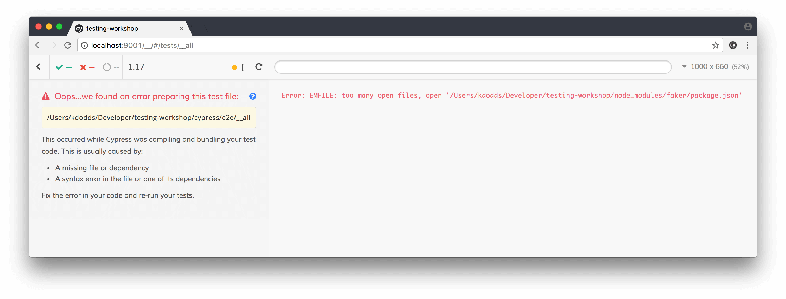
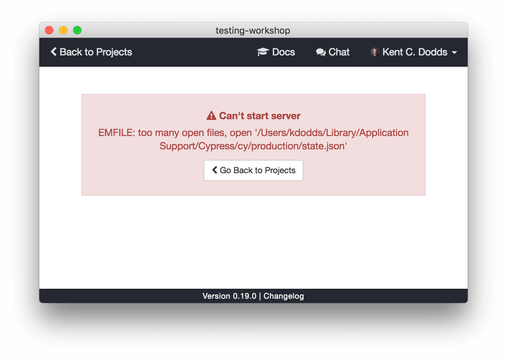
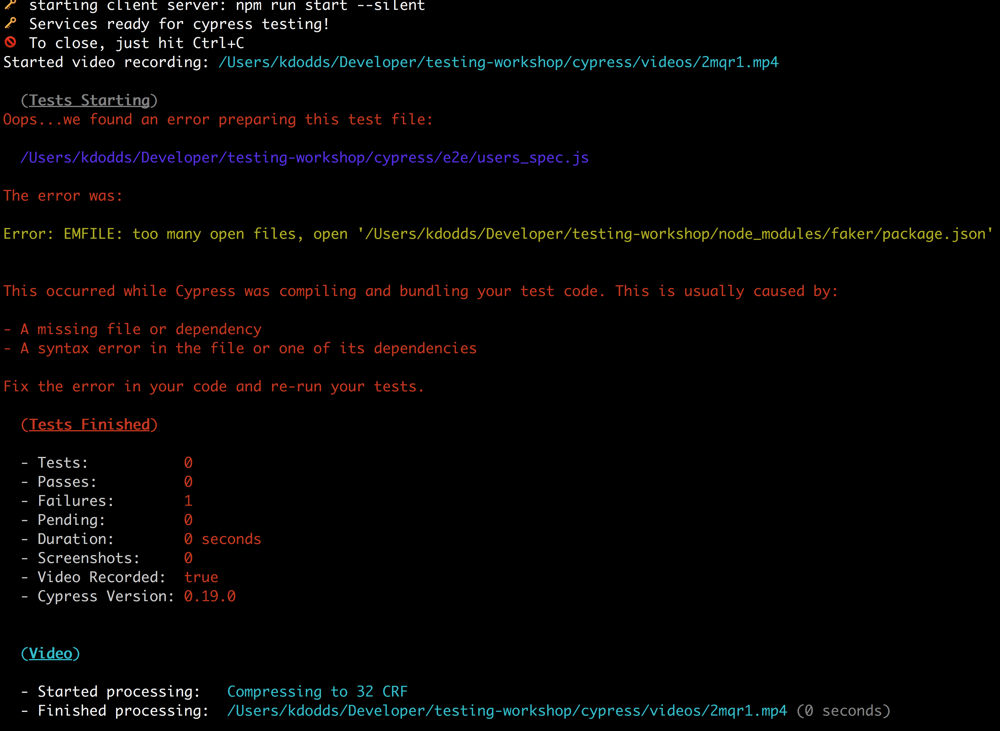

# Troubleshooting

## E2E tests

### Error: EMFILE: too many open files

This [happens sometimes](https://github.com/cypress-io/cypress/issues/369):

Or...

Or...

If this happens, I am really sorry! I've personally struggled a lot with this
error and I'm unsure of the steps to fix it. You might have success trying a
combination of some of these things:

- [Yosemite Upgrade Changes Open File Limit](http://blog.mact.me/2014/10/22/yosemite-upgrade-changes-open-file-limit)
- [El Capitan ulimit shenanigans](https://blog.dekstroza.io/ulimit-shenanigans-on-osx-el-capitan/)
- [Increase the maximum number of open file descriptors in Snow Leopard?](http://superuser.com/questions/302754/increase-the-maximum-number-of-open-file-descriptors-in-snow-leopard)
- [How to persist ulimit settings in OSX Mavericks?](http://unix.stackexchange.com/a/221988/29088)

Not sure what it is for windows (feel free to file a PR to this file if you
do know what the windows command is).
